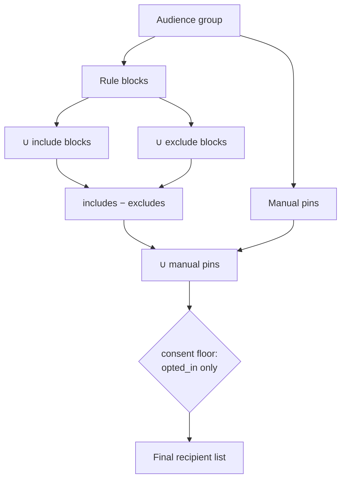

# Flow - Audience resolution

> Part of [[MOC - System Overview]]. How a saved audience group becomes a concrete
> list of people to send to. This is the step [[Flow - Send a campaign]] calls
> first (`prepare_send_from_audience` → `resolve_audience`).

## In one sentence

An audience group is resolved **live** — union its include rule blocks, subtract
its exclude blocks, add back the manually pinned recipients, then drop anyone not
consenting — so the recipient list reflects the rules *and the data* at the moment
you resolve.

## The formula

```
resolve_audience(group) =
    ( (∪ include blocks)  −  (∪ exclude blocks) )  ∪  (manual pins)
    then keep only consent_status == "opted_in"
```



## Step by step ([[audience]] `resolve_audience`)

1. **Load the blocks.** Each `AudienceRuleBlockDB` carries a `criteria` payload (language × status × category × min-score). `_recipients_for_criteria` evaluates it to a recipient set — a category min-score uses the recipient's **live [[insight]] signal**, so "interested in Hiking ≥ 40" re-evaluates as behavior changes.
2. **Union the includes.** All `kind="include"` blocks combine with **OR** — stack "interested in Hiking" OR "interested in Food", each editable/counted independently.
3. **Subtract the excludes.** All `kind="exclude"` blocks are unioned and removed from the include set.
4. **Add back the pins.** `AudienceGroupMemberDB` manual pins are unioned in **after** excludes — so **a pin is always included** even if an exclude block would have removed it. Hand-picked people survive the rules ("keep both").
5. **Apply the consent floor.** The result is filtered to `consent_status == "opted_in"` ([[recipients]] `CONSENTING_STATUS`). **This is the one thing that can drop a pin** — a non-consenting recipient is excluded even if pinned (legal, non-negotiable).
6. **Return** the recipient rows (ordered by email).

## Where this is used

- [[delivery]] `prepare_send_from_audience` — materialize a send's executions (see [[Flow - Send a campaign]]).
- [[delivery]] `reconcile_executions_to_audience` — a `"rerun"` send re-resolves *here* just before firing, so it can reach a different set than the plan showed.
- [[frontend]] — the group-detail "net audience" preview and the list-page recipient counts.

## Suggestions (use case 1)

A group can be **seeded from a campaign**: [[audience]] `create_suggested_group_for_campaign` reads the campaign's content categories ([[content]] assignments + resolved [[decision]] picks) and creates one `source="suggested"` include block per top category. `recalculate_suggested_blocks` re-derives them delta-only when the campaign's content changes — preserving manager-tuned thresholds and never touching manual blocks/pins. Engagement-driven suggestions are **parked** behind [[MOC - Automation Architecture|automation]].

## Modules this flow passes through

[[audience]] → [[content]] / [[insight]] (criteria evaluation) → [[recipients]] (consent floor). Seeding also reads [[campaigns]].

## ⚠️ Gotchas for a new dev

- **Precedence order is load-bearing.** Pins union *after* excludes subtract. An earlier version put pins into includes before subtracting excludes, so excludes silently dropped pins (group showed 17 instead of 21) — don't reorder.
- **Hard suppression ≠ an exclude block.** Bounces/opt-outs belong on the consent floor so they stay hard against pins. A regular exclude block would be overridden by a pin.
- **Resolution is live, not frozen.** The same group resolves differently next week as signals/consent change. A `"freeze"` send captures a moment; a `"rerun"` send re-resolves — that choice lives in [[delivery]], not here.
- **A group can resolve to 0** — [[delivery]] refuses to plan an empty send.
