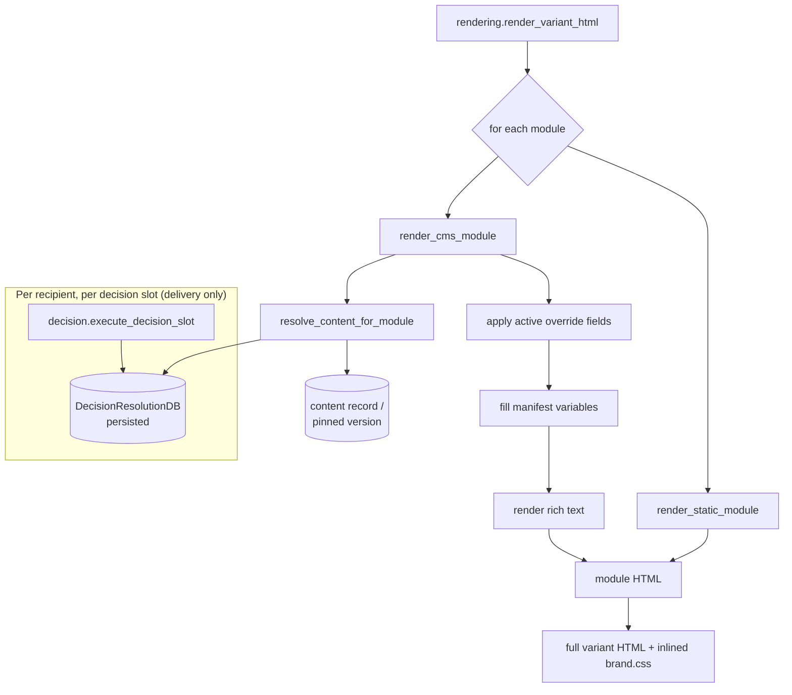

# Flow - Decision and rendering

> Part of [[MOC - System Overview]]. How a variant's module stack becomes final
> HTML for one recipient — the **personalize-then-render** path that
> [[Flow - Send a campaign]] runs per recipient, and that the preview page runs
> for a single view.

## In one sentence

For each module in a variant, the system resolves *what content goes there* (a
fixed record, or a per-recipient [[decision]] pick), applies any active
[[overrides|override]], fills the module template's variables, and stitches the
modules into one HTML document with brand CSS inlined.

## Two responsibilities, kept separate

**Deciding** (which content) and **rendering** (turning content into HTML) are
different modules on purpose. [[decision]] *executes* and records a pick;
[[rendering]] only *reads* the recorded pick. That's why a send **resolves
decisions first, then renders** — rendering never triggers a decision itself.

## Step by step

### Decide (only on the send path — [[decision]])
1. [[delivery]] calls `execute_decision_slot(slot, recipient)` for each slot on the variant *before* rendering.
2. The consent gate re-checks the recipient (belt-and-suspenders behind [[audience]]).
3. The slot's **strategy** (auto-discovered from `strategies/`, e.g. `recipient_top_score`) returns a `StrategyResult` — or `None` if nothing suitable (never raises, [[ADR-086 — Decision Slots Fail Gracefully]]).
4. The pick is persisted as a `DecisionResolutionDB` — but only a *new* row when the pick actually changed (bounded history). This row is the audit of what the recipient was shown ([[ADR-085 — Decision Resolution Should Be Optionally Explainable]]).

### Render ([[rendering]] `render_variant_html`)
5. Modules are pulled in `position` order.
6. **Per module**, `resolve_content_for_module` picks the content:
   - fixed-content module → its content record;
   - decision-slot module → **looks up** the recipient's existing `DecisionResolutionDB` (this is why decisions are resolved first — no resolution ⇒ the slot renders hidden).
   - `mode="send"` resolves the latest **published** version (raises if none — never sends a draft); `mode="preview"` shows the live draft.
7. **Override precedence** — for a CMS module, an active [[overrides|override]]'s field values win over the resolved content, per variable ([[ADR-041 — Override Precedence]]).
8. **Fill variables** — each manifest variable ([[email_modules]]) is looked up by name in the content dict (no mapping layer). Rich-text fields are rendered safely.
9. **Assemble** — module HTML is wrapped with `data-module`/`data-content` attributes and concatenated; brand CSS is inlined for email-client compatibility ([[ADR-063 — Rendering Parity Over Rendering Implementation]]).

## Modules this flow passes through

[[delivery]] (send path) → [[decision]] → [[campaigns]] (slots/resolutions) → [[rendering]] → [[content]] + [[email_modules]] + [[overrides]].

## ⚠️ Gotchas for a new dev

- **Rendering doesn't decide.** If a decision-slot module renders empty in a preview, it's because no resolution exists yet — that's expected until a send (or an explicit resolve) runs. Don't "fix" it by making rendering execute the slot; you'd double-resolve at send.
- **A module is content XOR a decision slot.** If both were somehow set, rendering silently prefers the content record — the [[campaigns]] CHECK constraint exists to prevent this.
- **`mode="send"` is strict.** No published version ⇒ `UnpublishedContentError`, by design — it refuses to send draft content. Preview is lenient.
- **Override keys must be real manifest variables** — validated at override-create time against [[email_modules]]; an unknown key can't be saved.
- **Variable name = content field name = manifest variable name.** A rename on any of the three blanks the variable everywhere.
