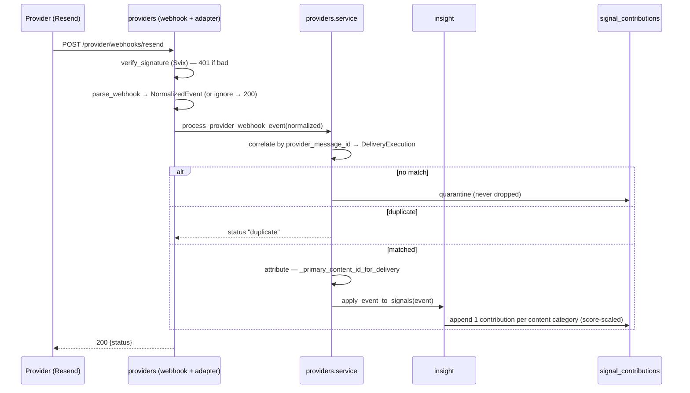

# Flow - Engagement to signal

> Part of [[MOC - System Overview]]. This is the **inbound half of the loop** — the
> outbound half is [[Flow - Send a campaign]]. It's how a real open/click becomes
> a change in someone's per-category interest, which then shapes their next
> [[decision]]. **Operational companion:** `docs/how-to-webhooks-engagement.md`
> (plain-language setup: DNS, webhook secret, ngrok).

## In one sentence

A provider webhook fires when a recipient engages; [[providers]] verifies it,
correlates it to the exact message they received, and [[insight]] turns a
content-tied click/open into decayed per-category **signal contributions** — live.

## The flow

## Step by step

1. **Receive** — the provider POSTs to the public route [[providers]] `POST /provider/webhooks/resend`.
2. **Verify** — `verify_signature` checks the Svix HMAC against `RESEND_WEBHOOK_SECRET`. Bad signature → **401**. No secret set → allowed *with a warning* (local dev only). *The secret only applies after a full server restart.*
3. **Normalize** — the Resend adapter maps the raw event name (`email.clicked`) to a canonical type (`click`) and extracts the `provider_message_id`. An unmapped event → **200 `ignored`** (so the provider doesn't retry forever).
4. **Correlate** — [[providers]] `ingest_provider_event` finds the `DeliveryExecutionDB` whose `provider_message_id` matches (the id [[delivery]] stamped at send). No match → **quarantined** ([[ADR-129 — Correlate Provider Events to Delivery Executions]], never silently dropped). Same event again → **duplicate**, recorded once (deterministic `provider_event_id` makes redelivery idempotent).
5. **Attribute** — for a click/open, `_primary_content_id_for_delivery` walks execution → send → [[snapshots|snapshot]] → variant to find **what the recipient actually received**: their resolved [[decision]] pick, else the variant's first fixed-content module. (Attribution is "what was shown", not link-parsing.)
6. **Signal** — [[insight]] `apply_event_to_signals` looks up the content's [[content]] category assignments and appends **one `SignalContributionDB` per category**, weighted `base_weight × (assignment.score / 10)`. Append-only — no running total is mutated.
7. **Respond 200** — with the outcome status.

## What this changes

- The recipient's per-category **signal** shifts immediately (computed on read, decayed by age — [[ADR-132 — Signal Layer Implementation Event-Sourced Contributions with Decay-on-Read]]). Next time [[decision]] `recipient_top_score` runs for them, the ranking reflects it. Loop closed.
- Weights encode reliability: **click = 5, open = 0 by default** (Apple MPP noise), unsubscribe strongly negative — see [[insight]].

## Modules this flow passes through

Provider (external) → [[providers]] → [[delivery]] (correlation target) → [[snapshots]] → [[campaigns]] (attribution walk) → [[content]] (category assignments) → [[insight]] → [[recipients]] (`signal_contributions`).

## ⚠️ Gotchas for a new dev

- **Correlation hinges on `provider_message_id` being unique.** It's set in [[delivery]]'s send loop; break its uniqueness and events mis-attribute or get quarantined.
- **A quarantined event is a signal, not a bug** — it usually means the send didn't record a message id (e.g. a mock send, or a failure). Check `GET /provider/quarantine`.
- **Opens move nothing by default** (weight 0). If you're testing signals, use a **click**.
- **Bounce/complaint don't produce category signals** — they belong on the consent/suppression path (parked). Only click/open are content-tied.
- **No secret = no security.** In production `RESEND_WEBHOOK_SECRET` must be set (and the server restarted). Never read `backend/.env` to check — ask or observe.
