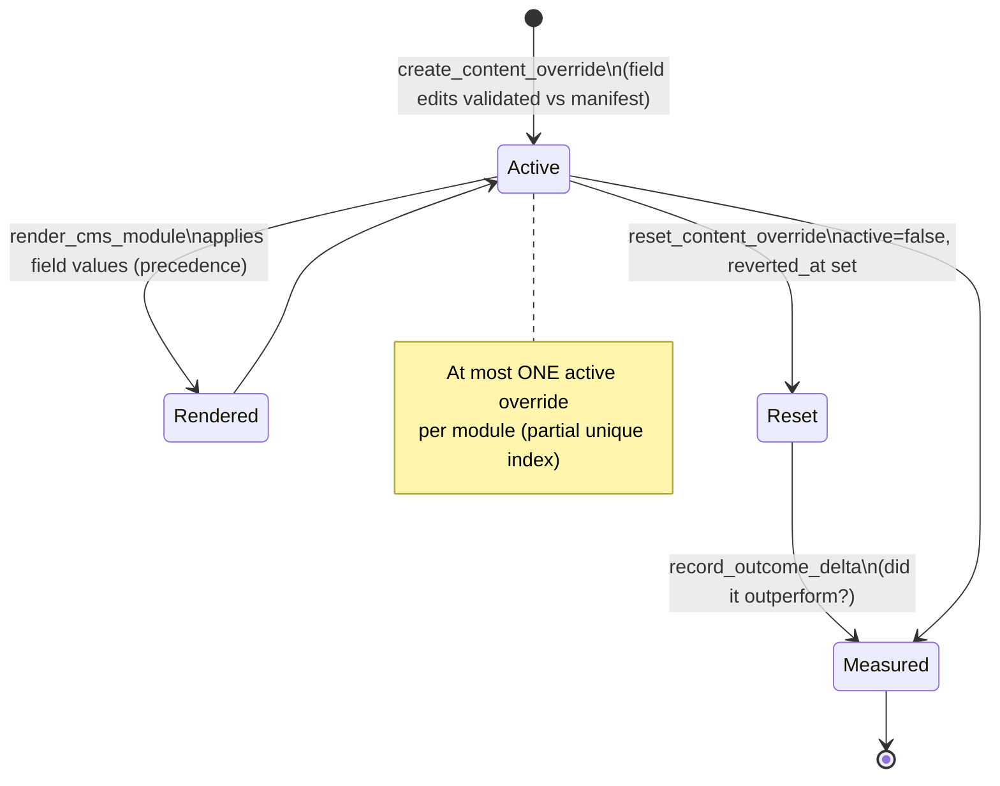

# Flow - Override lifecycle

> Part of [[MOC - System Overview]]. How a manager's manual edit to a module's
> content is created, applied at render time, reset, and later measured — the
> **create → active → reset** trust loop of the [[overrides]] layer.

## In one sentence

A manager overrides specific fields of a module; the edit takes precedence when
the email renders, stays a single active state per module, and on reset becomes
history — with the system's original context kept so you can later ask "did the
human edit beat the machine?"

## The lifecycle

## Step by step

### Create ([[overrides]] `create_content_override`)
1. The override targets a **module instance** ([[campaigns]]). It carries `field_overrides` = `{manifest field: value}` — a shorter headline for this send, a consistent title across personalized picks.
2. Edits are **validated against the module's manifest variables** ([[email_modules]]) — you can only override fields the module actually declares.
3. An override **must change something** (empty `field_overrides` is rejected — CHECK + service).
4. **One active override per module** — if one already exists, create fails asking you to reset it first (enforced by a partial unique index).

### Apply (render time — [[rendering]])
5. On every CMS-module render, `render_cms_module` calls `get_active_content_override` (O(1) via the index). If present, each overridden field's value **wins over** the resolved/static content, per variable ([[ADR-041 — Override Precedence]]). Non-overridden fields render normally.

### Reset ([[overrides]] `reset_content_override`)
6. Reset sets `active=false` + `reverted_at` — it **does not delete** the row ([[ADR-041 — Override Precedence|ADR-041]]'s "used until deleted or reset"). Rendering falls back to system-governed content. The module can now take a new override.

### Measure ([[overrides]] `record_outcome_delta`)
7. Once engagement data exists, `outcome_delta` is filled in retroactively (row-locked, merge-not-replace so open-rate today + click-rate next week both survive). This powers the "most overrides didn't outperform the system" trust argument.

## What an override is *not*

- **Not a record swap.** Swapping the whole content record for everyone means "use static content, not a decision slot"; a segment-targeted swap belongs to the (open) **guaranteed-placement** concept — which *suppresses the decision slot* for matching recipients rather than overriding it. Record "pins" were built, then deliberately removed. Overrides are **field edits only**.
- **Not audience overrides.** Deviating from a *system-suggested audience* is a separate future `AudienceOverrideDB` that will reuse this same create → active → reset spine — not this table.

## Modules this flow passes through

[[frontend]] (create/reset UI) → [[overrides]] → [[campaigns]] (module target) + [[email_modules]] (field validation) + [[content]] (audit context) → applied by [[rendering]].

## ⚠️ Gotchas for a new dev

- **Fields only** — don't reintroduce whole-record swaps here; that decision was made (and reverted) twice.
- **One active at a time** — a second create on the same module fails by design; reset first.
- **Reset keeps history** — never hard-delete an override; the trust-loop comparison and `outcome_delta` depend on the row surviving.
- **The UI is a dev affordance** — raw JSON field input today; the real deliverable is a WYSIWYG editor with live preview (a separate future stage). Don't polish the current UI; keep the backend model correct and flexible.
- **Override keys are validated** against the live [[email_modules]] manifest — a module template change that drops a variable can invalidate what an override targets.
