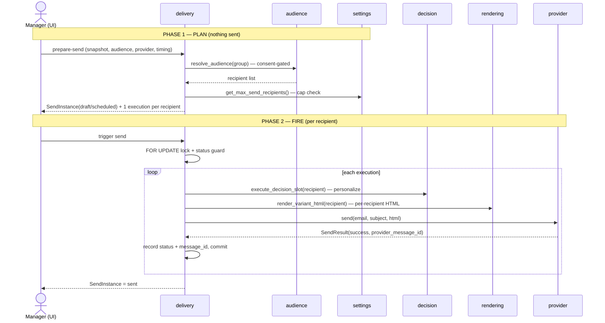

# Flow - Send a campaign (end to end)

> Part of [[MOC - System Overview]]. This is the **spine of the system**: how a
> composed campaign becomes real emails in real inboxes. Read this to understand
> *behavior across modules*; read each linked module page for its internal
> structure.

## In one sentence

A manager picks an **audience** for a campaign's snapshot, the system
**materializes one delivery execution per consenting recipient**, and on trigger
each recipient is **personalized, rendered, and handed to a provider** — with the
outcome recorded per recipient.

## The two phases

Sending is split into **plan** (decide who, create the records — reversible,
sends nothing) and **fire** (actually transmit). This is deliberate: a plan can
be reviewed, scheduled, or re-resolved before anything leaves the building.

## Step by step

### Phase 1 — Plan (`prepare_send_from_audience`)

Entry: [[frontend]] `POST /ui/campaigns/{campaign_id}/snapshots/{snapshot_id}/send-instances` → [[delivery]] `prepare_send_from_audience()`.

1. **Resolve the audience.** [[delivery]] calls [[audience]] `resolve_audience(group_id)`, which computes `((∪ include blocks) − (∪ exclude blocks)) ∪ (manual pins)` and then drops any non-consenting recipient (the **consent floor** — see [[recipients]]). *→ full detail in [[Flow - Audience resolution]] (planned).*
2. **Guard the size.** [[settings]] `get_max_send_recipients()` gives the cap; an empty audience or one over the cap raises and the plan is refused.
3. **Materialize records.** One `SendInstanceDB` is created plus **one `DeliveryExecutionDB` per recipient** (status `created`). Status is `draft`, or `scheduled` if a time was given.
4. **Choose the resolution mode** ([[ADR-052 — Delivery Layer Supports Multiple Audience Resolution Modes]]):
   - `"freeze"` — these executions are final; later rule edits don't change who receives it.
   - `"rerun"` — these executions are a preview; the group is re-resolved at fire time.

*Nothing has been sent. The plan is visible on the delivery page and can be triggered, scheduled, or abandoned.*

### Phase 2 — Fire (`send_send_instance`)

Entry: [[frontend]] `POST /ui/send-instances/{id}/send` (manual) **or** `process_due_scheduled_sends()` (a due scheduled send) → [[delivery]] `send_send_instance()`.

5. **Lock and guard.** A `SELECT ... FOR UPDATE` row lock + status check makes the `draft → sending` transition one-shot — a second concurrent trigger blocks, re-reads `sending`, and is rejected. No double-sends.
6. **Reconcile if `"rerun"`.** [[delivery]] `reconcile_executions_to_audience()` re-resolves the [[audience]] group *now* and adds newly-matching / drops no-longer-matching-and-unsent executions (re-checking the cap). `"freeze"` sends skip this.
7. **Resolve the subject.** From the [[campaigns]] `VariantDB.subject` (recipient-facing), falling back to the send instance's internal name.
8. **Per recipient, in a loop:**
   - **Personalize** — [[delivery]] calls [[decision]] `execute_decision_slot(slot, recipient)` for each decision slot on the variant, resolving *and persisting* that recipient's content pick. Without this a fresh recipient would render the personalized module hidden and have nothing to attribute engagement to. A strategy that resolves nothing fails gracefully ([[ADR-086 — Decision Slots Fail Gracefully]]) and the send continues. *→ [[Flow - Decision and rendering]] (planned).*
   - **Render** — [[rendering]] `render_variant_html(recipient, mode="send")` produces **that recipient's own HTML** (their decision pick + any [[overrides]], brand CSS inlined). Per-recipient, never one shared copy ([[ADR-083 — Personalization Happens Inside Variants Through Decision Slots]]).
   - **Transmit** — [[providers]] adapter (`mock` or `resend`, via `get_provider`) `send(email, subject, html)` returns a `SendResult`. The adapter never raises on failure — it returns `success=False` with the provider's message.
   - **Record** — the execution is set `sent`/`failed` with the `provider_message_id`, then **committed immediately** so a later failure in the batch can't roll back an already-sent row.
9. **Finish.** After the loop the send instance is marked `sent` (or `failed` if the loop raised).

## What this produces (and what happens next)

- A `provider_message_id` on each sent execution — the **correlation key** the [[providers]] inbound webhook later matches to attribute a click/open back to the exact message. That closes into [[Flow - Engagement to signal]] (planned) → [[insight]] → shapes the next [[decision]].
- A persisted `DecisionResolutionDB` per recipient — the audit of *what each person was shown*.

## Modules this flow passes through

[[frontend]] → [[delivery]] → [[audience]] → [[settings]] → *(fire)* → [[decision]] → [[rendering]] → *(via [[overrides]])* → [[providers]] → [[recipients]]. Anchored on a [[snapshots|snapshot]].

## ⚠️ Gotchas for a new dev

- **Two different "send" endpoints.** The rich planning form is the **UI** route (`POST /ui/campaigns/{campaign_id}/snapshots/{snapshot_id}/send-instances`); the JSON `/delivery/*` router only does low-level record creation + a bare trigger. Don't expect the JSON API to do audience resolution.
- **Decisions are resolved at *send* time, not compose time.** If personalization looks empty in a preview, that's expected until a send (or an explicit resolve) runs.
- **`"freeze"` vs `"rerun"` changes who gets it.** A scheduled `"rerun"` send can reach a *different* set than the plan showed. That's intended (Salesforce-style), but surprising if you assume the plan is final.
- **Scheduling is a seam, not a scheduler.** `process_due_scheduled_sends()` only fires *when something calls it* — a manual button today, a cron/worker/n8n in production. There is no background loop.
