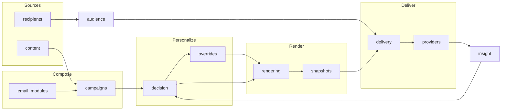

# MOC - System Overview

> **New here? Start on this page.** This is the code-level onboarding map for the
> Newsletter Blueprint backend — enough to take the codebase over: what each
> module owns, how they connect, and *what to check when you change one thing*.
> It sits next to the [[MOC - Newsletter Architecture]] (the *why* — ADRs) and
> [[MOC - Reference Implementation]] (what's built vs. deferred). This one is the
> *how the code is wired* view.

---

## How the documentation is layered

There are three places code is documented. Each answers a different question —
know which one to open:

| Layer | Answers | Where |
|---|---|---|
| **Module & flow pages** (this folder) | "How do the parts connect? What owns what? If I change X, what else breaks?" | `docs/architecture/Code/` (Obsidian) |
| **Swagger / OpenAPI** | "What HTTP endpoints exist, with what request/response shape?" | Run the app → `http://localhost:8000/docs` |
| **Docstrings & comments** | "How does *this function* work internally, and why?" | The code itself |

**Design rule that keeps this low-maintenance:** we document at the **module
level**, not the function level. There are ~290 functions — a page per function
would rot the day someone renames one. Module boundaries and the flows between
them change rarely, so these pages stay true. Function internals live in
docstrings (the source of truth); we do **not** re-transcribe them here. The
endpoint list lives in Swagger, generated from the code — never hand-maintained.

---

## The system at a glance

The backend is a FastAPI app (~14 modules, 70 files, 125 routes). Data flows
left-to-right: content and recipients come in, get composed into a campaign,
personalized per recipient, rendered to HTML, sent through a provider, and the
resulting engagement feeds back as signals that shape the next decision.



*Cross-cutting, not shown as flow nodes:* [[settings]] (app config, e.g. the send
cap) and [[frontend]] (the Jinja UI that drives all of the above).

---

## Modules by layer

Each links to its module page. One line = what it owns. Full detail is on the page.

### Sources — bring the raw material in
- [[content]] — the content catalog: reusable content records, categories, versions. Source of truth for *what can be said*.
- [[recipients]] — a **local projection** of CRM contacts (the CRM stays authoritative) plus consent status.

### Compose — assemble an email
- [[campaigns]] — a campaign (= one newsletter) with its variants, module instances, and decision slots. The structure, not the content.
- [[email_modules]] — the registry of email module templates (JSON manifest + HTML), drop-a-file plugin style. Defines what a "hero" or "img_left" module is.

### Personalize — decide what each person sees
- [[decision]] — resolves a decision slot to actual content per recipient via pluggable **strategies**. The personalization engine.
- [[overrides]] — a manager's field-level edits on top of a resolved module, logged against the system's original pick (trust-building audit).

### Audience — decide who receives it
- [[audience]] — audience groups built from live **rule blocks** + manual pins; `resolve_audience()` turns them into a consent-gated recipient list.

### Render — turn structure + content into HTML
- [[rendering]] — the HTML render pipeline: CMS + static modules, rich text, inlined brand CSS (Outlook-safe).
- [[snapshots]] — freezes the render state (context + HTML) so a send is reproducible and auditable. A snapshot ≠ a send.

### Deliver — send it, through a swappable provider
- [[delivery]] — send instances + per-recipient delivery executions; orchestrates the actual send loop.
- [[providers]] — the provider boundary: outbound send adapters (mock, Resend) *and* inbound webhook normalization (engagement → canonical events).

### Learn — feed engagement back
- [[insight]] — turns engagement (clicks/opens) into per-category **signal contributions** (append-only, decay-on-read). Closes the loop into [[decision]].

### Cross-cutting
- [[settings]] — app configuration (e.g. `max_send_recipients`), editable in the UI.
- [[frontend]] — the Jinja/Bootstrap admin UI. **57 routes in one file** — documented as a [[frontend#Route index|route index table]], not per-route pages.

---

## End-to-end flows

The journeys that cut across modules. Read these to understand *behavior*; read
module pages to understand *structure*.

- [[Flow - Send a campaign]] — plan an audience → personalize → render → send → record. The spine of the system.
- [[Flow - Engagement to signal]] — a click webhook → correlated to a delivery → per-category signal.
- [[Flow - Audience resolution]] — rule blocks + pins → consent-gated recipient list.
- [[Flow - Decision and rendering]] — a decision slot → resolved content → rendered HTML.
- [[Flow - Override lifecycle]] — create → active → reset, with counterfactual audit.

---

## The special case: `frontend/router.py`

One file, 57 routes, ~59 functions — the entire admin UI. Documenting it
per-route would be 57 pages that rot. Instead [[frontend]] carries a **route
index table grouped by feature** (Content, Campaigns, Audience, Deliveries, …),
each row: method, path, what it does. The Jinja templates it renders live in
`backend/app/templates/`.

---

## Keeping this map honest (anti-drift)

- **[[Module dependency map]]** — a small, re-runnable script
  (`backend/scripts/gen_module_map.py`) reads the `import` graph and regenerates
  the "depends on / depended on by" edges, so the relationships on module pages
  are checked against the actual code, not memory. Re-run it after changing
  module boundaries:
  ```bash
  cd backend && python scripts/gen_module_map.py
  ```
- **Swagger is generated**, not written — the endpoint reference can't drift from
  the routes.
- If you rename a module or move a boundary, update *its* page and this map. If
  you change a function's internals, update the **docstring** — not these pages.

## Related
- [[MOC - Newsletter Architecture]] — the ADR-backed *why*
- [[MOC - Reference Implementation]] — implemented / partial / deferred status
- [[MOC - Interview Prep Baseline]] — the review questions behind many decisions
