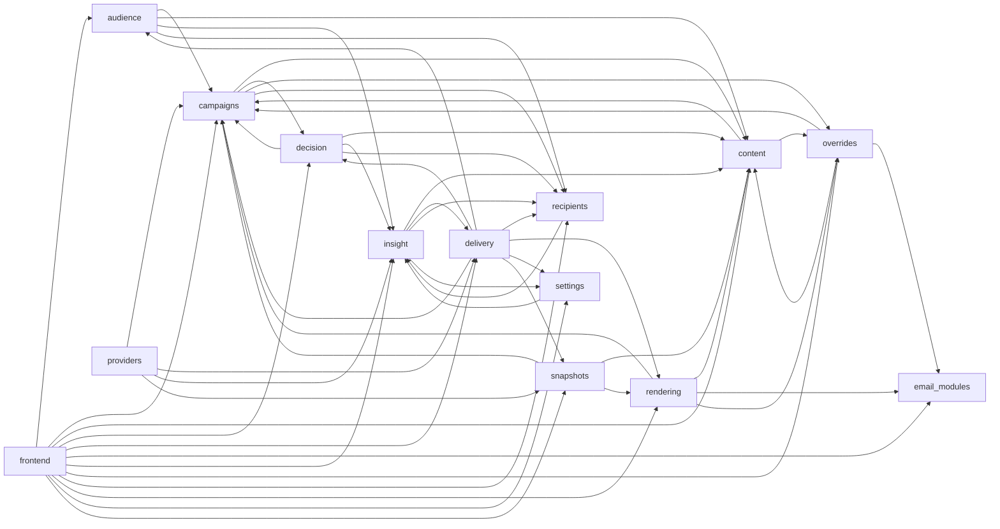

# Module dependency map

> **Auto-generated** by `backend/scripts/gen_module_map.py` from the `import` graph — do not edit by hand. Re-run after changing module boundaries. Part of [[MOC - System Overview]].

An arrow **A --> B** means module A imports from module B (A depends on B). Function-local imports are included.

## Edge table

| Module | Depends on → | Depended on by ← |
|---|---|---|
| **audience** | campaigns, content, insight, recipients | delivery, frontend |
| **campaigns** | content, decision, overrides, recipients | audience, content, decision, delivery, frontend, overrides, providers, rendering, snapshots |
| **content** | campaigns, overrides | audience, campaigns, decision, frontend, insight, overrides, rendering, snapshots |
| **decision** | campaigns, content, insight, recipients | campaigns, delivery, frontend |
| **delivery** | audience, campaigns, decision, recipients, rendering, settings, snapshots | frontend, insight, providers |
| **email_modules** | — | frontend, overrides, rendering |
| **frontend** | audience, campaigns, content, decision, delivery, email_modules, insight, overrides, recipients, rendering, settings, snapshots | — |
| **insight** | content, delivery, recipients, settings | audience, decision, frontend, providers, recipients, settings |
| **overrides** | campaigns, content, email_modules | campaigns, content, frontend, rendering |
| **providers** | campaigns, delivery, insight, snapshots | — |
| **recipients** | insight | audience, campaigns, decision, delivery, frontend, insight |
| **rendering** | campaigns, content, email_modules, overrides | delivery, frontend, snapshots |
| **settings** | insight | delivery, frontend, insight |
| **snapshots** | campaigns, content, rendering | delivery, frontend, providers |
