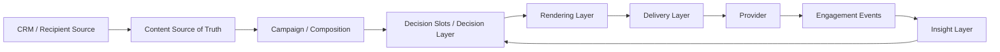
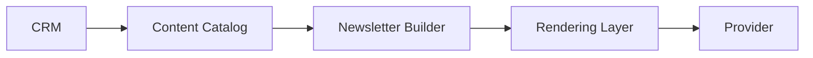
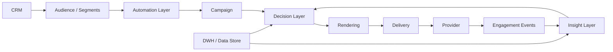

# MOC - Newsletter Architecture

	# MOC - Newsletter Architecture

## Architecture Principles

- [[Newsletter Architecture Design Principles]]

## Foundation

- [[ADR-001 — Newsletter Architecture Boundaries]]
- [[ADR-002 — API First Architecture]]
- [[ADR-003 — Human-Guided Marketing, AI-Optimized Delivery]]
- [[ADR-004 — Privacy Operations as a First-Class Architectural Concern]]
- [[ADR-125 — Define a Minimal Reference Architecture]]

## Architecture Areas

- [[MOC - Content Architecture]]
- [[MOC - Composition Architecture]]
- [[MOC - Rendering Architecture]]
- [[MOC - Delivery Architecture]]
- [[MOC - Decision Architecture]]
- [[MOC - Automation Architecture]]
- [[MOC - Provider Architecture]]
- [[MOC - Insight Architecture]]
- [[MOC - Data Foundation]]

## Main Architecture Flow

## Minimal Reference Architecture

## Extended Architecture

## Principles

- [[Newsletter Architecture Design Principles]]
