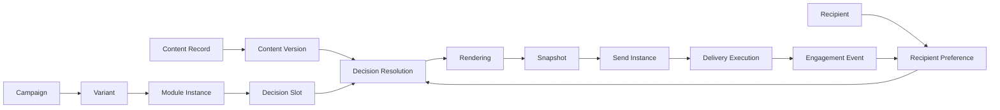

# **MOC - Reference Implementation**

## **Purpose**

This note tracks the current implementation state of the Newsletter Reference Architecture.

See also: [[MOC - Interview Prep Baseline]] — living log of interview-style review questions (why this approach, edge cases, ADR drift) generated against this implementation.

It separates:

- implemented
- partially implemented
- planned
- intentionally deferred

---

## **Current Architecture Flow**



---

## **Implemented Domains**

### **Content Domain**

Implemented:

- ContentRecord
- Category
- ContentCategoryAssignment
- ContentVersion

Status:

```text
usable for POC
```

Notes:

- ContentVersion uses flexible JSON content.
- ContentRecord still contains simple title/body fields for early POC compatibility.
- DecisionResolution can reference ContentVersion.

---

### **Campaign Domain**

Implemented:

- Campaign
- Variant
- ModuleInstance

Status:

```text
usable for POC
```

Rules:

- Campaign creation creates an initial Variant.
- Variant represents the composition.
- ModuleInstance may reference static ContentRecord or dynamic DecisionSlot.

---

### **Decision Domain**

Implemented:

- DecisionSlot
- DecisionResolution
- Strategy Registry
- top_score strategy
- recipient_top_score strategy

Status:

```text
core concept proven
```

Notes:

- DecisionResolution supports global and recipient-specific decisions.
- Recipient-aware decision execution is implemented.
- DecisionResolution can reference ContentVersion.

---

### **Recipient Domain**

Implemented:

- Recipient
- RecipientPreference

Status:

```text
usable for POC
```

Notes:

- Recipient is a local projection.
- CRM remains source of truth.
- Preferences can be manually created and updated from engagement events.

---

### **Rendering Domain**

Implemented:

- Variant rendering
- Recipient-aware rendering
- ContentVersion-aware rendering

Status:

```text
functional HTML proof
```

Notes:

- Rendering reads existing DecisionResolutions.
- Rendering does not execute decisions.
- HTML output is still simple preview HTML, not production email HTML.

---

### **Snapshot Domain**

Implemented:

- Snapshot metadata
- Snapshot HTML file storage
- Global snapshots
- Recipient-aware snapshots

Status:

```text
usable for POC
```

Notes:

- Snapshot HTML is stored as file.
- Database stores metadata and file location.
- Recipient-specific snapshots are supported.

---

### **Delivery Domain**

Implemented:

- SendInstance
- DeliveryExecution
- Mock Provider Adapter

Status:

```text
provider abstraction proven
```

Notes:

- SendInstance links Snapshot to a send context.
- DeliveryExecution links SendInstance to Recipient.
- Mock provider updates DeliveryExecution status and provider_message_id.

---

### **Insight Domain**

Implemented:

- EngagementEvent
- Event-to-preference update

Status:

```text
learning loop proven
```

Notes:

- Events are provider-neutral.
- Click events can update RecipientPreferences.
- Preference updates respect ContentCategoryAssignment score.

---

## **Implemented End-to-End Loop**

```text
Content
→ ContentVersion
→ Category
→ Recipient
→ Preference
→ Campaign
→ Variant
→ Module
→ DecisionSlot
→ DecisionExecution
→ DecisionResolution
→ Rendering
→ Snapshot
→ SendInstance
→ DeliveryExecution
→ EngagementEvent
→ PreferenceUpdate
→ FutureDecision
```

---

## **Key Architecture Decisions Confirmed by POC**

- Campaign = sendable email context
- Variant = composition
- ModuleInstance = structural placement
- DecisionSlot = decision intent
- DecisionResolution = decision result
- RecipientProjection ≠ CRM
- ContentVersion = audit-relevant content state
- Snapshot ≠ Send
- SendInstance ≠ Recipient delivery
- DeliveryExecution = recipient-level delivery record
- Provider = adapter, not architecture core
- EngagementEvent = normalized provider-independent signal

---

## **Partially Implemented**

### **Content Draft / Publish**

ADR exists conceptually via ContentVersioning.

Current state:

```text
manual ContentVersion creation
```

Deferred:

- Draft model
- Publish button
- Approval workflow
- conflict handling
- optimistic locking

---

### **Provider Integration**

Current state:

```text
mock provider only
```

Deferred:

- Resend adapter
- Brevo adapter
- Mailjet adapter
- SES adapter
- webhook ingestion
- provider-specific metadata mapping

---

### **Production Rendering**

Current state:

```text
simple HTML preview
```

Deferred:

- email-compatible table rendering
- responsive email HTML
- inline CSS
- tracking parameter injection
- unsubscribe/footer rendering
- plain text alternative

---

## **Planned Next Architecture Areas**

### **Provider Event Normalization**

Goal:

```text
Provider webhook
→ canonical EngagementEvent
```

Why:

- closes real provider feedback loop
- keeps Insight Domain provider-neutral
- supports later provider switching

---

### **Provider Correlation Strategy**

Goal:

```text
provider event
→ delivery_execution_id
```

Possible identifiers:

- provider_message_id
- custom metadata
- tracking URL parameters
- recipient_id + send_instance_id fallback

---

### **Decision Strategy Expansion**

Possible strategies:

- latest_content
- balanced_mix
- category_rotation
- exploration
- ai_ranked

---

## **Intentionally Deferred**

- Frontend
- real provider sending
- authentication / authorization
- approval workflow
- production-grade email rendering
- migrations with Alembic
- multi-user editing
- full CRM synchronization
- consent enforcement
- unsubscribe handling
- deliverability optimization
- AI integration