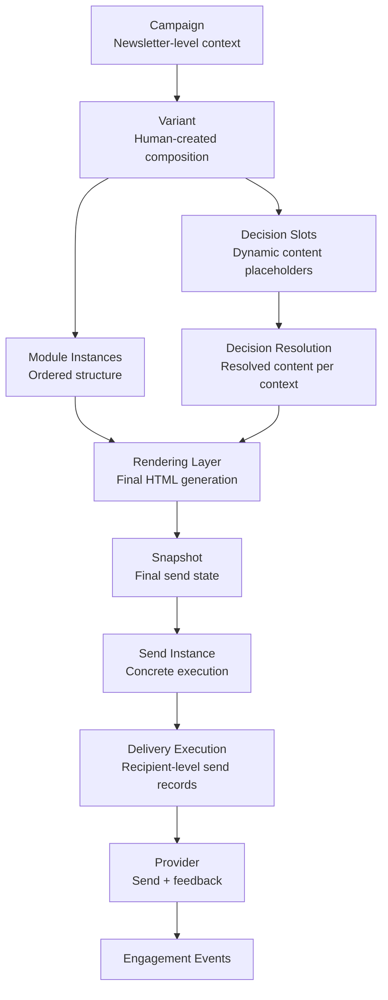

# Reference Architecture - Execution Flow

## Purpose

This model shows how a campaign moves from editable composition to actual delivery.

## Diagram

## Key Rules

- Campaign equals newsletter-level context.
- Variant equals composition.
- Decision Slots resolve content, not structure.
- Snapshot belongs to Send Instance, not to Variant.
- Delivery Execution records what was sent to whom.
- Engagement Events record what happened afterwards.

## Related ADRs

- [[ADR-020 — Campaign Equals Newsletter]]
- [[ADR-021 — Variants Are Human Created Versions]]
- [[ADR-083 — Personalization Happens Inside Variants Through Decision Slots]]
- [[ADR-084 — Decision Slots May Resolve One or Multiple Content Records]]
- [[ADR-095 — Use Send Instances for Technical Execution Tracking]]
- [[ADR-061 — Snapshot Based Final Rendering]]
- [[ADR-053 — Maintain Minimal Delivery Execution History]]
