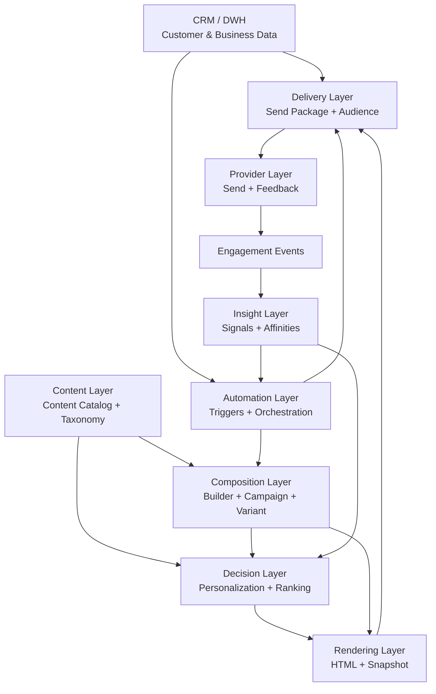

# Reference Architecture - High Level

## Purpose

This model shows the main architectural layers of the vendor-neutral newsletter reference architecture.

It is intentionally high-level and should be used as the entry diagram for the handbook.

## Diagram

## Layer Responsibilities

### CRM / DWH

Provides customer, recipient, consent, segment and business context data.

### Content Layer

Owns reusable newsletter-ready content, taxonomy and metadata.

### Composition Layer

Defines campaigns, variants, module instances, overrides and decision slots.

### Decision Layer

Selects or ranks content for dynamic slots based on governed rules, signals and candidate sets.

### Rendering Layer

Transforms composition, resolved content and design rules into final email HTML and snapshots.

### Delivery Layer

Prepares send packages, audience information and delivery metadata.

### Provider Layer

Sends emails and returns delivery or engagement feedback.

### Insight Layer

Transforms engagement events into reusable signals.

### Automation Layer

Orchestrates triggers, timing, recurring flows and campaign references.

## Related ADRs

- [[ADR-001 — Newsletter Architecture Boundaries]]
- [[ADR-002 — API First Architecture]]
- [[ADR-010 — Newsletter Content Source of Truth]]
- [[ADR-030 — Separate Global and Repeatable Structures]]
- [[ADR-050 — Delivery Layer is Part of the Reference Architecture]]
- [[ADR-060 — Rendering as Independent Layer]]
- [[ADR-080 — Human-governed Taxonomy Before AI Selection]]
- [[ADR-090 — Automation References Campaigns, Not Decisions]]
- [[ADR-100 — Provider Layer as Send and Feedback Adapter]]
- [[ADR-110 — Insight Layer Transforms Events Into Signals]]
- [[ADR-120 — CRM as Customer Source of Truth]]
