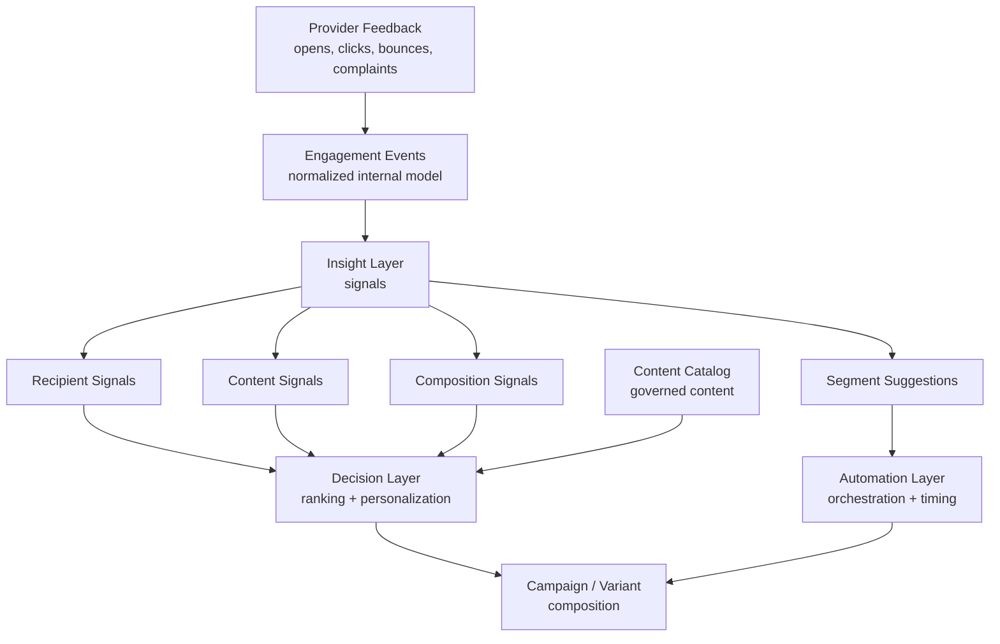

# Reference Architecture - Learning Loop

## Purpose

This model shows how the architecture learns from delivery and engagement without depending on a single provider.

## Diagram

## Key Rules

- Engagement Events are normalized before use.
- Insight Layer answers: what happened?
- Decision Layer answers: what should be selected next?
- Automation Layer answers: when and why should communication happen?
- AI may recommend, but not publish unapproved content.

## Related ADRs

- [[ADR-055 — Separate Delivery Execution from Engagement Events]]
- [[ADR-056 — Engagement Events as Foundation for Automation]]
- [[ADR-080 — Human-governed Taxonomy Before AI Selection]]
- [[ADR-081 — AI Ranks Within Governed Candidate Sets]]
- [[ADR-082 — AI May Recommend but Not Publish]]
- [[ADR-110 — Insight Layer Transforms Events Into Signals]]
- [[ADR-111 — Decision Layer Consumes Signals, Not Raw Events]]
- [[ADR-112 — Signals Use Time-Based Decay]]
- [[ADR-113 — Separate Operational and Historical Signals]]
