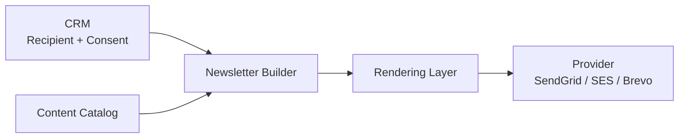
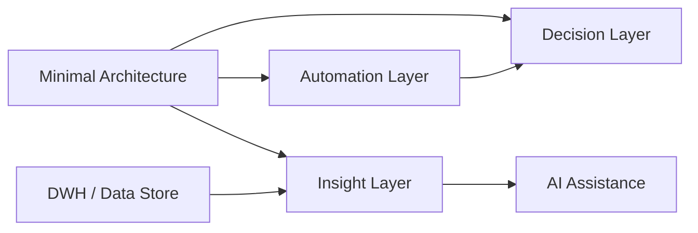

# Reference Architecture - Minimal Implementation Path

## Purpose

This model shows the smallest useful implementation of the reference architecture.

It is intended for small teams or organizations starting from scratch.

## Minimal Architecture

## Minimal Responsibilities

### CRM

- recipientId
- email
- consent status
- createdAt
- modifiedAt
- optional country and language

### Content Catalog

- reusable content records
- metadata
- categories
- image URLs

### Newsletter Builder

- campaign
- variant
- module instances
- overrides
- subject
- preheader

### Rendering Layer

- final HTML
- tracking metadata
- optional snapshot

### Provider

- send email
- return at least bounce and complaint feedback

## Optional Growth Path

## Related ADRs

- [[ADR-125 — Define a Minimal Reference Architecture]]
- [[ADR-120 — CRM as Customer Source of Truth]]
- [[ADR-121 — Minimal Recipient Model]]
- [[ADR-124 — DWH Is Recommended but Not Mandatory]]
- [[ADR-100 — Provider Layer as Send and Feedback Adapter]]
