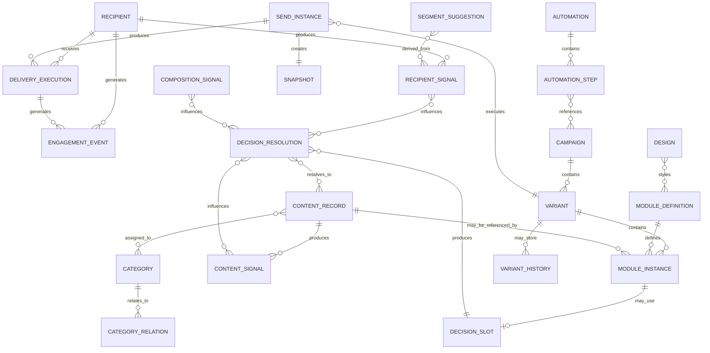

# Reference Data Model

## Purpose

This model describes the conceptual data objects of the newsletter reference architecture.

It is not a database schema. It defines architectural objects and their relationships.

## Diagram

## Core Objects

### Recipient

A known person or contact that can receive communication.

Authoritative recipient data belongs to the CRM.

### Content Record

A reusable communication unit.

Business-specific objects such as product, destination, offer or article are modeled as content subtypes, not as fixed architecture objects.

### Category

A metadata structure used to classify content and support decisioning.

### Category Relation

A relationship between categories used to support controlled semantic expansion.

### Design

Visual and brand rules.

Design defines colors, typography, spacing, button styles, footer behavior and rendering constraints.

Design is not a template.

### Module Definition

A reusable structural component such as image-left, image-right, three-column block, headline, CTA or divider.

### Module Instance

A concrete use of a Module Definition inside a Variant.

It may reference a Content Record, but it may also be fully manual.

### Variant

A human-created composition within a Campaign.

Variant equals Composition.

### Decision Slot

A dynamic area inside a Variant where content is resolved later.

Decision Slots resolve content, not structure.

### Decision Resolution

A concrete result of a Decision Slot.

It documents which Content Records were selected and optionally why.

### Snapshot

The final rendered send state for a Send Instance.

Snapshot is not version history.

### Send Instance

A concrete technical execution of a send.

### Delivery Execution

Recipient-level send record.

### Engagement Event

Normalized internal event created from provider feedback.

### Signals

Aggregated data derived from Engagement Events.

Types:

- Recipient Signal
- Content Signal
- Composition Signal
- Segment Suggestion

### Automation

Orchestration structure that references Campaigns.

Automation does not make content decisions.

## Important Modeling Rules

### Variant equals Composition

There is no separate Composition object.

### Decision Slots resolve content, not structure

The module is selected by the human or automation setup. The content inside the slot may be dynamic.

### Snapshot belongs to Send Instance

A snapshot represents the actual send state.

Variant History is a different optional concept.

### Overrides are Variant-scoped Module Data

Overrides are not standalone objects.

### Business-specific content objects are subtypes

Products, offers, destinations or articles are not hard-coded architecture objects.

## Related ADRs

- [[ADR-012 — Content Records Represent Communication Units]]
- [[ADR-013 — Content Reference Instead of Content Copy]]
- [[ADR-020 — Separate Global and Repeatable Structures]]
- [[ADR-021 — Newsletter Equals Composition]]
- [[ADR-030 — Introduce Override Layer]]
- [[ADR-031 — Override Precedence]]
- [[ADR-041 — Campaign as Email-Level Context]]
- [[ADR-042 — Variants Represent Content Alternatives]]
- [[ADR-083 — Personalization Happens Inside Variants Through Decision Slots]]
- [[ADR-095 — Use Send Instances for Technical Execution Tracking]]
- [[ADR-110 — Insight Layer Transforms Events Into Signals]]
- [[ADR-120 — CRM as Customer Source of Truth]]
