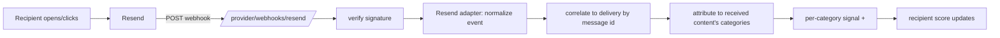

# How to: live engagement tracking (Resend webhooks)

*Turning real opens/clicks into live per-category scoring. Plain-language explanation first, setup steps second.*

## What this does (in one paragraph)

When someone **opens or clicks** a newsletter you sent, Resend notifies our system through a **webhook** — an HTTP callback Resend POSTs to a URL we expose. Our system checks the message is genuinely from Resend, works out *who* engaged and *what content* they engaged with, and nudges that person's **per-category interest score**. So engagement feeds scoring automatically — the "inbound" half of the loop (the "outbound" half being sending the email).

## The loop, end to end

```
1. SEND      You send a campaign to a recipient via Resend.
             → we store a "delivery execution" row with Resend's message id,
               and record what content that recipient received.

2. ENGAGE    The recipient opens or clicks in the email.
             → Resend POSTs an event to our webhook.

3. VERIFY    We check the Svix signature (is this really Resend?).

4. TRANSLATE We map Resend's event ("email.clicked") to our internal
             type ("click") and pull out the message id.

5. CORRELATE We find the delivery by that message id (unmatched → quarantined;
             duplicate → ignored).

6. ATTRIBUTE For a click, we look up the content that recipient received and
             raise the score for that content's categories.

7. SEE IT    The recipient's page shows the updated score.
```



## The pieces (which file does what)

| File | Role in the loop |
|---|---|
| [`providers/adapters/resend.py`](../backend/app/providers/adapters/resend.py) | **Steps 3–4.** Verifies the Svix signature and translates a raw Resend payload into our internal `NormalizedEvent`. This is the *one worked example* of an inbound adapter — mirrors the outbound `DeliveryProvider`. |
| [`providers/router.py`](../backend/app/providers/router.py) → `POST /provider/webhooks/resend` | The **public endpoint** Resend calls. Returns 200 for handled *and* ignored events (so Resend doesn't retry things we don't map); 401 only on a bad signature. |
| [`providers/service.py`](../backend/app/providers/service.py) → `process_provider_webhook_event` | **Steps 5–6.** Orchestrates: correlate → attribute → apply signal. |
| `providers/service.py` → `ingest_provider_event` | The correlate/dedup/quarantine logic (already existed). |
| `providers/service.py` → `_primary_content_id_for_delivery` | Works out *what content* a recipient received — their resolved personalized pick, else the variant's first fixed-content module. |
| [`insight/service.py`](../backend/app/insight/service.py) → `apply_event_to_signals` | Turns one engagement event into per-category signal contributions (already existed). |
| [`delivery/service.py`](../backend/app/delivery/service.py) → `send_send_instance` | **Step 1.** Now resolves + records each recipient's content at send time, so there's something to attribute engagement to. |

## Setup — to make it live

Resend can't reach `localhost`, so the endpoint must be publicly reachable.

1. **Expose the server publicly** (dev: a tunnel):
   ```bash
   ngrok http 8000
   ```
2. **Resend dashboard → Webhooks → Add endpoint:** `https://<your-tunnel>/provider/webhooks/resend`. Subscribe to `email.clicked`, `email.opened`, `email.bounced`, `email.complained`, `email.delivered`. Copy the **signing secret**.
3. **Add the secret to `backend/.env`:** `RESEND_WEBHOOK_SECRET=whsec_...`, then **restart the server** (it reads `.env` at startup). Until this is set, signature verification is *skipped* with a warning — fine for local testing, never for production.
4. **Send via the campaign flow** — build/pick an audience with your recipient, then **Prepare send → provider `resend` → Plan delivery → Trigger send**.

Then open/click the email and watch the recipient's score on `/ui/recipients/<id>`.

## Gotchas

- **Use the campaign send, not Send test.** Send test sends a real email but creates *no* delivery record, so its opens/clicks can't be correlated — they'd be quarantined.
- **Opens don't move the score.** Open weight is 0 by default (Apple Mail Privacy Protection makes opens unreliable). **Clicks** are what move scoring.
- **A new recipient needs a starting interest.** With zero signals, the personalized picker resolves nothing, so the email has no scored content to click. Seed a declared interest (e.g. the `ds@` demo recipient starts with Hiking).
- **Bounce/complaint → opt-out is not wired yet.** These events are *recorded* but don't yet auto-update consent — parked in `docs/backlog.md`.

## Extending to another provider

Copy `providers/adapters/resend.py` and change three things: the **signature check**, the **event-name map**, and the **field paths** for message id / event data. Everything downstream (correlate, attribute, apply signal) is provider-agnostic. This is deliberate — see the inbound-adapter item in `docs/backlog.md`.
